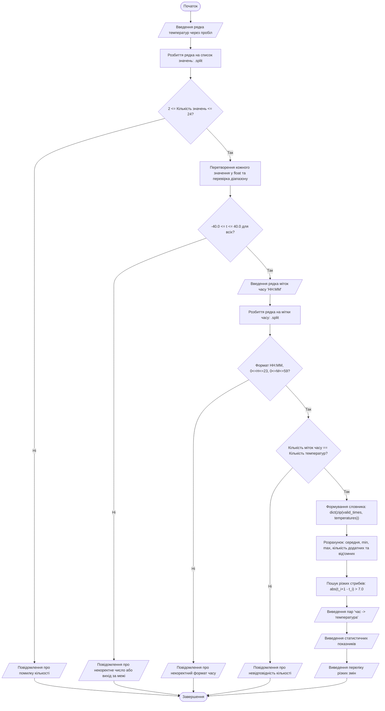

```mermaid
flowchart TD
    Start([Початок])
    InpTemp[/Введення рядка температур через пробіл/]
    SplitTemp[Розбиття рядка на список значень: .split]
    CheckCount{"2 <= Кількість значень <= 24?"}
    ErrCount[/Повідомлення про помилку кількості/]
    Stop([Завершення])
    ParseLoop[Перетворення кожного значення у float та перевірка діапазону]
    CheckRange{"-40.0 <= t <= 40.0 для всіх?"}
    ErrRange[/Повідомлення про некоректне число або вихід за межі/]
    InpTime[/Введення рядка міток часу 'HH:MM'/]
    SplitTime[Розбиття рядка на мітки часу: .split]
    ValidateTime{"Формат HH:MM, 0<=H<=23, 0<=M<=59?"}
    ErrTime[/Повідомлення про некоректний формат часу/]
    MatchLens{"Кількість міток часу == Кількість температур?"}
    ErrMatch[/Повідомлення про невідповідність кількості/]
    CreateDict["Формування словника: dict(zip(valid_times, temperatures))"]
    CalcStats["Розрахунок: середня, min, max, кількість додатних та від'ємних"]
    ScanDeltas["Пошук різких стрибків: abs(t_i+1 - t_i) > 7.0"]
    PrintTable[/Виведення пар 'час -> температура'/]
    PrintStats[/Виведення статистичних показників/]
    PrintAlerts[/Виведення переліку різких змін/]

    Start --> InpTemp
    InpTemp --> SplitTemp
    SplitTemp --> CheckCount
    CheckCount -- Ні --> ErrCount --> Stop
    CheckCount -- Так --> ParseLoop
    ParseLoop --> CheckRange
    CheckRange -- Ні --> ErrRange --> Stop
    CheckRange -- Так --> InpTime
    InpTime --> SplitTime
    SplitTime --> ValidateTime
    ValidateTime -- Ні --> ErrTime --> Stop
    ValidateTime -- Так --> MatchLens
    MatchLens -- Ні --> ErrMatch --> Stop
    MatchLens -- Так --> CreateDict
    CreateDict --> CalcStats
    CalcStats --> ScanDeltas
    ScanDeltas --> PrintTable
    PrintTable --> PrintStats
    PrintStats --> PrintAlerts
    PrintAlerts --> Stop
```
